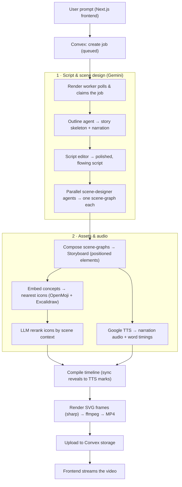

# Whiteboard Explainer Video Generator

Turn a one-line prompt into a narrated, hand-drawn **whiteboard explainer video** — fully
AI-directed, scene by scene.

You type *“Explain how the water cycle works.”* A chain of AI agents writes a real script, designs
each scene as a diagram, picks the most fitting hand-drawn icons, narrates it, and renders a synced
MP4 where every element draws itself in as it’s spoken.

## Demo Video

[Watch the Demo](https://github.com/Avinash1286/Whiteboard-Explainer-Video-Generator/blob/main/demo/final.mp4)

---

## ✨ What it does

- **Writes a genuine script**, not a fact list — a hook, a guiding analogy, curiosity gaps between
  scenes, and a memorable takeaway (a write-then-edit, two-pass writer).
- **Designs each scene in parallel** — a dedicated agent per scene picks the clearest layout
  (flow, comparison, hub, grid, cycle, fan-out, convergence, decision, hero…).
- **Chooses icons by meaning, in context** — semantic search over ~30k hand-drawn icons (OpenMoji +
  Excalidraw libraries), then an LLM reranks the candidates using the scene’s actual context (so
  “mouse” becomes a *computer mouse* in a tech scene, not the animal).
- **Renders hand-drawn** — icons wipe in outline-then-fill, captions and arrows animate, the heading
  writes itself in, all synced word-for-word to the narration.
- **Reliable by construction** — a deterministic layout engine enforces spacing, prevents overlaps,
  and fits every scene to the frame. No silent failures: a stuck job fails with a clear reason and a
  **Resume / Regenerate** button.

---

## 🧠 How the pipeline works



**In one breath:** prompt → script → per-scene diagrams → contextual icons → narration → a
deterministic layout/animation engine → SVG frames → ffmpeg MP4.

The **frontend** and the **CLI** both call the exact same `runVideoPipeline`, so what you preview
locally is what the app produces.

---

## 🗂 Project layout

| Path | What’s in it |
|---|---|
| `app/` | Next.js frontend (prompt box, live progress, video player, grid-background toggle) |
| `convex/` | Convex backend — job table, mutations, a watchdog cron that fails stuck jobs |
| `worker/` | The render worker: agents (`agents.ts`), icon rerank, embeddings, TTS, ffmpeg, pipeline |
| `shared/` | The engine — `sceneGraph.ts` (layout solver), `svgFrame.ts` (renderer), icon resolvers, timeline |
| `scripts/` | One-off tools: ingest/convert icon libraries, build embeddings, render locally |
| `assets/` | Fonts + vendored icon libraries + their search indexes |

---

## 🚀 Run it locally

### Prerequisites
- **Node.js 20+**
- **ffmpeg** on your PATH (`ffmpeg -version`)
- A **Convex** account (free) — the job queue / storage / frontend data
- A **Google Cloud** project with **Vertex AI** (Gemini) and **Cloud Text-to-Speech** enabled, plus a
  **service-account JSON key** (used for both planning and narration)

### 1. Clone & install
```bash
git clone <your-repo-url>
cd <repo>
npm install
```

### 2. Configure environment
```bash
cp .env.example .env.local
```
Fill in `.env.local`:
- `GOOGLE_CLOUD_PROJECT` and `GOOGLE_APPLICATION_CREDENTIALS` (absolute path to your key — **keep the
  key file outside the repo**)
- `GEMINI_MODEL` (e.g. `gemini-3.5-flash`) — drives every reasoning agent
- Convex URLs are filled in by `convex dev` in the next step

> Every model id is read from env (`GEMINI_MODEL`, `RERANK_MODEL`, `SVG_GENERATOR_MODEL`,
> `EMBED_MODEL`). Nothing is hardcoded.

### 3. Start Convex (backend)
```bash
npx convex dev
```
This provisions a dev deployment and writes `CONVEX_DEPLOYMENT` / `VITE_CONVEX_URL` into `.env.local`.

### 4. Build the asset library
The renderer needs the icon library and indexes (these are git-ignored — see *Open-sourcing notes*):
```bash
npm run assets:openmoji          # ingest OpenMoji icons + manifest
# optional, for the full hand-drawn set + best semantic matching (needs the GCP key):
#   the scripts under scripts/excalidraw/ ingest + embed the Excalidraw libraries
#   and scripts/build-openmoji-embeddings.ts builds the OpenMoji embedding index
```
*Without the embedding indexes the app still runs — icon matching falls back to keyword scoring.*

### 5. Run the worker and the frontend (two terminals)
```bash
npm run worker        # the render worker (long-running; restart after .env or code changes)
npm run dev           # the Next.js frontend on http://localhost:5173
```
Open the app, type a prompt, and watch it build.

### Render without the frontend (handy for iterating)
```bash
npm run render:local "Explain how the water cycle works"
# → outputs/local-<timestamp>/final.mp4
```

### Tests
```bash
npm test              # layout-engine unit tests (deterministic, no API calls)
```

---

## ⚙️ Configuration (env vars)

| Var | Purpose | Default |
|---|---|---|
| `GEMINI_MODEL` | Director, scene designers, script editor | `gemini-3.5-flash` |
| `RERANK_MODEL` | Context-aware icon reranker | falls back to `GEMINI_MODEL` |
| `SVG_GENERATOR_MODEL` | Fallback icon generator | falls back to `GEMINI_MODEL` |
| `EMBED_MODEL` | Icon embeddings (must match the prebuilt index) | `gemini-embedding-001` |
| `VERTEX_LOCATION` / `VERTEX_EMBED_LOCATION` | Vertex regions | `global` / `us-central1` |
| `GOOGLE_TTS_VOICE` / `GOOGLE_TTS_LANGUAGE` | Narration voice | `en-US-Chirp3-HD-Charon` / `en-US` |
| `VIDEO_WIDTH/HEIGHT/FPS` | Output resolution | `1920×1080 @ 12` |
| `SCENE_DESIGN_CONCURRENCY` | Parallel scene designers | `5` |

See `.env.example` for the full list.


